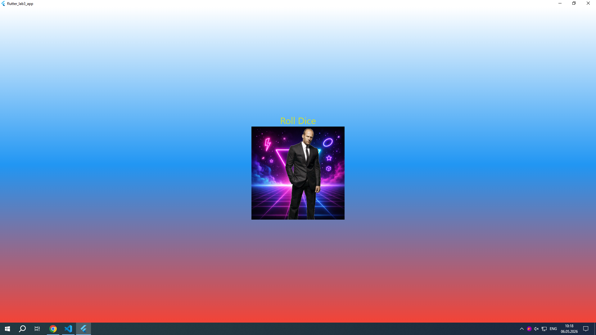

# Лабораторная работа №3. Flutter: структура UI и компонентный подход

**Студент:** Шапкин
**Группа:** ИСП-232
**Дата сдачи:** 6 мая 10:21 на паре

## Что изучили
1. **Компонентный подход:** Разбиение интерфейса на независимые, переиспользуемые виджеты, что упрощает поддержку и масштабирование проекта.
2. **Работа с файловой структурой:** Вынесение виджетов в отдельные файлы с соблюдением соглашений Dart (`snake_case`) и правильное управление импортами.
3. **Передача данных:** Использование параметров конструктора и `final`-полей для гибкой настройки виджетов без жёсткой привязки к конкретным значениям.
4. **Управление состоянием:** Различия между `StatelessWidget` и `StatefulWidget`, а также механизм перерисовки интерфейса через `setState()`.
5. **Работа с ассетами и логикой:** Подключение изображений через `pubspec.yaml`, генерация случайных чисел и динамическая смена контента в runtime.

## Скриншот финального приложения

## Ссылка на репозиторий
[GitHub Repository](https://github.com/kosmys122/Flutter_Lab3.git)

## Инструкция по запуску
1. Убедитесь, что у вас установлен Flutter SDK и добавлен в системный `PATH`.
2. Клонируйте репозиторий:  
   `git clone <URL_вашего_репозитория>`
3. Перейдите в директорию проекта:  
   `cd flutter_lab3_app`
4. Установите зависимости (если необходимо):  
   `flutter pub get`
5. Запустите приложение в браузере Chrome:  
   `flutter run -d chrome`

## Ответы на вопросы

### 1. Зачем выносить виджеты в отдельные файлы? Что изменится если держать всё в `main.dart`?
Вынесение виджетов улучшает читаемость кода, упрощает навигацию и позволяет переиспользовать компоненты в разных частях приложения. Если оставить всю разметку в `main.dart`, файл быстро станет перегруженным, его будет сложно редактировать и тестировать, а также нарушится принцип единственной ответственности (SRP), что в реальных проектах приводит к ошибкам и долгой поддержке.

### 2. Что такое `BuildContext`? Почему метод `build()` принимает его как параметр?
`BuildContext` — это объект, который хранит информацию о положении конкретного виджета в дереве виджетов Flutter. Он передаётся в `build()` автоматически при каждой перерисовке, чтобы виджет мог обращаться к родительским элементам, получать данные темы, маршруты или вызывать перерисовку дерева. Без `BuildContext` Flutter не смог бы корректно связать конфигурацию виджета с его местом в UI-иерархии.

### 3. Чем `StatelessWidget` отличается от `StatefulWidget`? Приведите пример, когда нужен каждый из них.
| Характеристика | `StatelessWidget` | `StatefulWidget` |
|---|---|---|
| **Состояние** | Отсутствует. Виджет неизменяем после создания. | Присутствует. Хранится в отдельном объекте `State`. |
| **Перерисовка** | Происходит только при изменении внешних параметров. | Происходит при вызове `setState()`, который обновляет только изменившуюся часть UI. |
| **Пример использования** | Статичный текст, фоновый контейнер, иконка, заголовок экрана. | Счётчик кликов, поле ввода текста, переключатель, игра с кубиком (где меняется изображение по нажатию). |

### 4. Почему `Random()` создаётся на уровне файла, а не внутри `rollDice()`?
Создание экземпляра `Random` на уровне файла позволяет переиспользовать один генератор на протяжении всего жизненного цикла приложения. Если создавать `Random()` внутри функции при каждом нажатии, будет постоянно выделяться новая память под объект, что менее эффективно. Кроме того, при очень быстрых последовательных вызовах новые экземпляры могут генерировать одинаковые начальные значения (из-за совпадения seed на основе системного времени), тогда как один переиспользуемый экземпляр гарантирует качественную псевдослучайную последовательность.